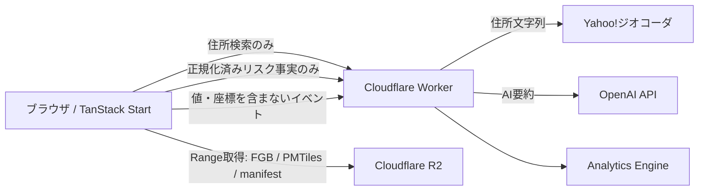

# 災害リスク比較アプリ MVP実装計画

- 対象期間: 2週間（10開発日を想定）
- 開発体制: 1人 + AI開発支援
- 対象地域: 関東1都6県
- 配置先: Cloudflare Workers + R2
- データ版: ハッカソン用の固定スナップショット

## 1. 完成条件

ユーザーがログインせずに住所を検索し、地図上のピンを確認・修正して、1地点の災害リスクを調査できる。必要なら地点を最大3件まで追加し、同じ指標を横並びで比較できる。

結果には次を含める。

- 関東のA31a想定最大規模洪水浸水深区分
- 公開・収録されている関東のA53頻度別洪水浸水深区分
- 東京都内の建物倒壊危険度ランクと火災危険度ランク
- 値、区域外、未公開、対象外、判定不能の区別
- 複数河川・水系が重なる場合の最大浸水深区分と全根拠
- 指標ごとの半径25m境界警告
- データ名、提供者、基準時点、取得日、利用条件および注意事項

Yahoo住所検索、OpenAI要約または分析機能が停止しても、確定済み座標から公開データを調査する中核機能は壊さない。

## 2. MVPの範囲

### P0: 必ず完成させる

- 1地点から開始し、最大3地点まで段階的に追加できる入力UI
- Yahoo住所候補検索と、候補選択による地点確定
- 地図上のピン確認・ドラッグ修正
- 関東外の地点に対する対象外案内
- R2上のFlatGeobufを用いたブラウザ内GIS判定
- A31a、A53、東京都地域危険度の結果表示
- データ状態、重複、境界警告および根拠情報
- 1指標だけを表示する地図と凡例
- 1〜3地点のレスポンシブ比較表
- ローディング、部分失敗、再試行および判定不能表示
- Cloudflareへの本番配置

### P1: P0の後に実装する

- 最近使った地点のlocalStorage保存・復元・削除
- 地点判定のsessionStorageキャッシュ
- URLフラグメントによる簡易共有
- ボタン操作時だけ生成するプレーンテキストAI要約
- Cloudflare Web Analyticsと最小限のAnalytics Engineイベント
- 外部API経路のRate Limiting Binding

### P2: 余裕がある場合だけ実装する

- 二択フィードバック
- 詳細な処理時間イベント
- 広域PMTilesレイヤーの表示品質調整
- 細かなトランジションとデモ向け演出

P0が遅れた場合はADR-0025の順でP1・P2を削減する。

### MVPに含めない

- ログイン、アカウント、D1およびサーバー保存履歴
- 全国分のGIS成果物
- 定期データ更新、差分取込みおよび更新通知
- 重視条件、総合スコア、地点の推奨および順位付け
- 期限付き・取り消し可能な共有リンク
- OpenUIによるGenerative UI
- 複数の災害レイヤーを同時に重ねる地図

## 3. 実行時アーキテクチャ



### ブラウザの責務

- 地点、比較および選択中指標のUI状態
- R2マニフェストとカバレッジの読込み
- FlatGeobufの空間候補取得
- point-in-polygon、重複解決、水系関連付けおよび半径25m境界検査
- PMTilesの地図描画
- localStorage、sessionStorageおよびURLフラグメント

### Workerの責務

- Yahoo APIキーとOpenAI APIキーの秘匿
- 入力スキーマ、Origin、メソッドおよび本文サイズの検証
- 外部APIのタイムアウトと安全なエラー変換
- AI要約の文字数・禁止表現検証
- 匿名分析イベントの許可リスト検証
- 終盤で追加する緩いレート制限

### R2の責務

- 版付きで不変なFlatGeobuf、PMTiles、manifest、coverage、checksums
- Range要求と長期キャッシュに対応した公開配信
- 元ZIPや変換途中データは公開しない

## 4. 推奨するコード構成

最初から細分化し過ぎず、純粋な判定ロジックと外部I/Oの境界だけを分ける。

```text
src/
  components/
    location-input/
    map/
    results/
    shared/
  domain/
    location.ts
    risk.ts
    evidence.ts
    comparison.ts
  features/
    geocoding/
    investigation/
    comparison/
    sharing/
    ai-summary/
  gis/
    manifest.ts
    flatgeobuf-source.ts
    geometry.ts
    flood-evaluator.ts
    tokyo-risk-evaluator.ts
    boundary-warning.ts
  routes/
    __root.tsx
    index.tsx
    api.geocode.ts
    api.ai-summary.ts
    api.events.ts
  storage/
    recent-locations.ts
    investigation-cache.ts
  test-fixtures/
scripts/
  data/
    README.md
    download.*
    transform.*
    validate.*
data-manifest/
  sources.lock.json
```

ルートファイルはデータ取得と画面構成に限定し、浸水深の優先順位やデータ状態判定をReactコンポーネントへ書かない。

## 5. 追加候補ライブラリ

ライブラリは実データ技術検証後にVite+経由で追加する。

- `maplibre-gl`: 地図本体
- `pmtiles`: MapLibreからR2のPMTilesをRange取得
- `flatgeobuf`: ブラウザからFlatGeobufの空間候補を取得
- Turfの必要な個別パッケージ: 25mバッファ、交差、point-in-polygonなど
- `zod`: マニフェスト、外部API入力、キャッシュおよび共有フラグメントの実行時検証
- OpenAI公式SDKまたは小さな`fetch`ラッパー: Worker互換性を技術検証して小さい方を選択

データ加工ではGDAL、Tippecanoe、PMTiles CLIを候補とする。現在のローカル環境では検出できていないため、Day 1で導入方法と版を`data-manifest/sources.lock.json`および`scripts/data/README.md`へ固定する。

## 6. 公開データ加工パイプライン

### 6.1 入力を固定する

各データセットについて、配布ページ、ファイルURL、提供者、基準年度、取得日、ライセンス、ファイルサイズおよびSHA-256を記録する。

- A31a: 関東1都6県の想定最大規模洪水浸水想定区域
- A53: 関東で公開されている頻度別洪水浸水想定区域
- 東京都地域危険度: 全町丁目のCSVとGIS形状

配布元のファイルを差し替えられても、同じハッカソン版を再生成できるように、入力チェックサムが一致しない場合は処理を停止する。

元データと生成済みGIS成果物はGitへコミットせず、変換スクリプト、入力ロック、マニフェスト、検証レポートおよび小さなテストfixtureだけを管理する。公開成果物は版付きでR2へ配置する。

### 6.2 正規化する

- 座標系をWGS84へ統一
- 不正形状を検出し、修復前後の件数を記録
- A31aとA53の河川・水系コードを正規化
- コード不足時だけ版管理された対応表を使用
- 浸水深の元コード、元ラベル、下限、上限を生成
- A53の年超過確率を列挙型へ変換
- 東京都の町丁目コード、名称、建物倒壊ランク、火災ランクおよび根拠値を正規化
- ブラウザ判定に不要な属性を除去

### 6.3 成果物を作る

初期の分割単位は都県・データ種別・降雨規模とする。Day 2の性能計測で必要な場合だけ水系単位へ細分化する。

```text
risk-data/v1/
  manifest.json
  coverage.json
  checksums.json
  query/a31a/{prefecture}.fgb
  query/a53/{returnPeriod}/{prefecture}.fgb
  query/tokyo/regional-risk.fgb
  map/a31a.pmtiles
  map/a53/{returnPeriod}.pmtiles
  map/tokyo-building-collapse.pmtiles
  map/tokyo-fire.pmtiles
```

### 6.4 マニフェストに持たせる情報

- `schemaVersion`
- `dataVersion`
- `logicVersion`
- データセット識別子、名称、提供者、基準時点、取得日、利用条件、出典URL
- 成果物URL、ファイルサイズ、SHA-256、都県、指標、年超過確率
- 属性スキーマ版
- 変換ツールと変換処理版

### 6.5 カバレッジに持たせる情報

- 対応都県と境界
- A31aの収録成否
- A53の水系、降雨規模、公開状況、収録成否および関連付け状態
- 東京都地域危険度の対象町丁目と除外地域
- 変換失敗または未解決地物の件数

### 6.6 データ検証の合格条件

- 入力と成果物のチェックサムが生成される
- 全成果物を再度開いて属性スキーマを検証できる
- 不正形状、空形状、範囲外座標および未知の浸水深コードが0件、または除外理由が明記される
- A31aからA53へ関連付けられない河川・水系が一覧化される
- 各都県で既知の区域内・区域外テスト地点を最低2件ずつ用意する
- 複数河川重複、境界25m以内、東京都町丁目境界のfixtureを用意する
- 変換を再実行して同じ件数と論理内容を得られる

## 7. ブラウザ地点判定

### 判定順序

1. 座標が関東1都6県の対象範囲か確認
2. 対象都県のA31aをbbox検索
3. 正確なpoint-in-polygonで一致地物を抽出
4. 上限、次に下限で最大浸水深区分を選択し、全河川を根拠へ保存
5. A31a一致河川から候補水系を取得
6. カバレッジを確認し、対象A53だけを降雨規模ごとに検索
7. A53も最大浸水深区分と全水系を保持
8. 東京都内だけ地域危険度町丁目を検索
9. 各指標について25m bboxの候補を取得し、25mバッファ内の異なる判定を確認
10. データ状態、境界警告、根拠および版を含む`InvestigationResult`を返す

### 結果の原則

- bbox一致だけで値を確定せず、正確な形状照合を行う
- `区域外`はカバレッジ確認後だけ返す
- 取得失敗や破損を`区域外`へ変換しない
- 境界警告でピン地点の主結果を置き換えない
- 地図レイヤー変更で判定を再実行しない
- 同じ座標・データ版・ロジック版はsessionStorageから再利用する

## 8. 主要画面と操作

### 初期画面

- 対応地域と扱うデータを短く説明
- 地点1の住所入力だけを表示
- 最近使った地点はP1として入力候補の下に表示
- 住所候補選択後にピンと`この地点を調べる`を表示
- `比較地点を追加`で地点2、地点3を段階表示

### 結果画面

- 地点名、表示住所、ピン修正操作
- 1地点では縦方向の詳細カード
- 2〜3地点では同じ指標を列で比較
- データ状態は値と同じ位置に表示し、色だけに依存しない
- 境界警告は該当指標の近くに表示
- 根拠情報は詳細開閉で確認可能
- 結果表の指標選択と地図レイヤーを連動
- 地図には1主題レイヤーと全地点ピンを表示
- AI、共有、フィードバックは結果本体の後に配置

### レスポンシブ方針

- PC: 地図と結果を2カラム、比較表は地点列
- モバイル: 地図と結果を縦積み、地点比較は指標ごとのカードまたは横スクロールを避けた縦比較
- キーボードだけで住所候補選択、地点追加、指標切替、詳細開閉が可能
- 地図操作だけを地点確定の唯一の手段にしない

## 9. 外部API

### Yahoo住所検索

- 明示的な検索操作または短いdebounce後だけ呼ぶ
- 端末内の最近使った地点を先に提示
- Workerは住所文字列をYahooへ中継し、レスポンスをアプリ共通候補形式へ正規化
- 検索文字列、住所、座標をWorkerログとAnalytics Engineへ書かない
- Yahoo障害時も共有リンクや確定済みピンからの判定を利用可能にする

### OpenAI要約

- ユーザーが`AIで要約`を押した場合だけ1リクエスト
- 住所、座標、地点名および自由入力を含めない
- 正規化済みの1〜3地点の事実だけを送る
- 同一指標の事実比較に限定し、推奨、総合順位、独自スコアを禁止
- 非ストリーミング、最大800文字、20秒タイムアウト
- モデルID、プロンプト版および最大出力は環境変数またはサーバー設定で差し替え可能にする
- AI本文はエスケープ済みテキストとして表示
- 同じタブでは入力ハッシュ、モデル、プロンプト版、出力版をキーに再利用

### レート制限

- 全主要機能の後に実装
- OpenAI: 5回/10秒
- Yahoo: 20回/10秒
- 経路種別と接続元IPをキーにするが、IPを永続保存しない

## 10. 端末内保存と共有

### localStorage

- 最近使った地点を最大10件、90日で失効
- 表示住所、確定座標、最終利用時刻だけを保存
- 個別削除と全削除を用意
- 判定結果、AI要約、境界警告は保存しない

### sessionStorage

- 地点判定結果
- AI要約
- スキーマ版が不明、破損またはデータ版不一致なら破棄
- 一時通信エラーは保存しない

### URLフラグメント

- ユーザーが明示的に共有リンクを作成した場合だけ生成
- 版、1〜3地点の座標、順序、作成日だけを含める
- 住所、地点名、判定結果、AI要約を含めない
- 復元後は現在版で再判定
- 不正な形式、範囲外、過剰精度、過長値を拒否

## 11. テスト戦略

### 単体テスト

- 浸水深区分の正規化と最大区分選択
- 重複河川・水系の全根拠保持
- A31aからA53への関連付け
- A53の区域外、未公開、判定なし、判定不能
- 東京都地域危険度の対象内・対象外
- 25m境界警告の内側、外側、ちょうど境界
- 比較行の組立てと比較不能状態
- キャッシュキーと版不一致
- 最近使った地点の上限、期限、削除
- 共有フラグメントの正常系と改ざん
- AI入力に住所・座標・地点名が入らないこと
- 分析イベントに禁止フィールドが入らないこと

### データ契約テスト

- manifest、coverageおよび各属性のZod検証
- 全浸水深コードが正規化表に存在する
- 全A53水系が関連付け済みまたは理由付き未解決
- FGBとPMTilesが同じ正規化済み入力版から生成される

### 結合・手動E2E

最低限、次のデモ経路を毎日確認する。

1. 東京都内1地点: 洪水 + 建物倒壊 + 火災
2. 東京と県外の2地点: 洪水比較 + 東京指標の対象外
3. 3地点: 重複河川 + A53未公開を含む比較
4. 境界付近でピン移動後に警告と結果が変わる
5. 関東外住所で対象外案内
6. Yahoo、R2、OpenAIそれぞれの失敗時表示
7. モバイル幅、キーボード操作、色を使わない状態識別

### 完了時コマンド

- コード変更ごとに関連テスト
- 毎日の終了時に`rtk vp check`と`rtk vp test`
- デプロイ候補では`rtk vp check`、`rtk vp test`、`rtk vp build`
- 依存関係整理時に`rtk vp run fallow`
- UI完成時に`rtk vp run doctor`

## 12. 2週間スケジュール

### Day 1: データと実行環境を固定

- Cloudflare Workersへの最小デプロイを成立させる
- R2バケット、公開配信URL、CORSおよびRange応答を確認
- GIS加工ツールの導入方法と版を固定
- A31a、A53、東京都地域危険度の入力ファイルとチェックサムを固定
- 1都県・1データセットの変換スクリプトを作る

完了条件: 実データのFGBをR2へ置き、ブラウザからbbox Range取得できる。

### Day 2: GIS技術検証

- A31aのpoint-in-polygon、重複解決、25m境界検査
- MapLibre + PMTilesの1レイヤー表示
- スマートフォン相当のネットワーク・CPUで初回判定を計測
- FGBの分割単位と属性削減を確定

ゲート: 1地点の初回判定が概ね1秒を超える場合、この日に分割または簡略化を直す。解決しなければPMTilesより地点判定を優先する。

### Day 3: 全データ変換

- 関東A31aを生成
- 公開されている関東A53を生成
- 東京都地域危険度を生成
- manifest、coverage、checksums、検証レポートを生成
- 全成果物をR2へ配置

完了条件: 既知fixtureについてCLIまたは小さな検証画面から期待結果を得られる。

### Day 4: ドメイン判定を完成

- 型と純粋関数を実装
- A31a、A53、東京都地域危険度を`InvestigationResult`へ統合
- データ状態、全根拠、境界警告を実装
- 単体テストとデータ契約テストを完成

完了条件: UIなしでもfixtureから全指標の期待JSONを生成できる。

### Day 5: 住所入力と1地点調査

- Yahoo Worker経路と候補UI
- 地点確定、ピン表示、ドラッグ修正
- 関東内外判定
- 1地点の結果カード、状態、根拠、再試行

中間ゲート: 本番相当環境で「住所入力から1地点結果まで」を通す。通らない場合はP1を開始しない。

### Day 6: 比較と地図

- 地点2・3の段階追加
- 同指標の比較表
- 選択中指標と単一地図レイヤーの連動
- A53降雨規模切替
- 東京都外の地域危険度対象外表示
- PC・モバイルの主要レイアウト

完了条件: 1地点、2地点、3地点の全経路が同じ調査結果モデルで動く。

### Day 7: 正確性と障害対応

- sessionStorage判定キャッシュ
- R2部分失敗、Yahoo失敗、破損マニフェストの表示
- キーボード操作、フォーカス、色以外の状態表示
- fixtureを使った回帰確認
- 根拠・注意事項の文言確定

完了条件: 外部APIを意図的に失敗させても中核結果が不正な`区域外`にならない。

### Day 8: P1機能

- 最近使った地点
- 簡易共有フラグメント
- AI要約
- 最小限の匿名イベント

ゲート: Day 7のP0に未完があれば、ADR-0025に従ってこの日の機能を削りP0へ戻る。

### Day 9: 本番検証と防御

- Rate Limiting Binding
- Cloudflare Web Analytics
- キャッシュヘッダー、CORS、Secret、環境変数の確認
- 本番スマートフォンで主要7経路を確認
- `rtk vp check`、`rtk vp test`、`rtk vp build`、fallow、doctor
- 二択フィードバックは余裕がある場合のみ

完了条件: 新しいブラウザ・共有リンク・低速回線でデモ経路が再現する。

### Day 10: バッファと提出準備

- 未解決バグをP0から修正
- 代表地点とデモ手順を固定
- 使用オープンデータ、構成図、制約、今後の全国展開をREADMEへ整理
- 出典リンクとライセンス表示を最終確認
- 本番タグ相当のデータ版・アプリ版を記録
- 最終デプロイ後は新機能を追加しない

完了条件: デモ手順を初見のブラウザで2回連続して完走できる。

## 13. 日次の進捗判定

毎日終了時に次だけを記録する。

- 今日の完了条件を満たしたか
- 本番相当URLで動いた経路
- 未解決のP0障害
- 翌日の最初に検証する仮説
- ADR-0025による削減判断が必要か

「ほぼ完成」は完了に数えず、fixture、画面または本番URLで再現できることを基準にする。

## 14. 本番設定チェックリスト

- Worker Secret: Yahoo APIキー、OpenAI APIキー
- 通常設定: OpenAIモデル、プロンプト版、データ版、判定ロジック版、R2公開ベースURL
- R2: versioned artifact、Range、CORS、Content-Type、ETag、長期Cache-Control
- Worker: 許可Origin、入力上限、タイムアウト、エラー本文の秘匿
- ブラウザ: 本番ではRouter Devtoolsを表示しない
- 分析: 住所、座標、入力文字列、判定値、IPをイベントへ含めない
- 共有: URLフラグメントがWorkerログ・分析へ渡らない
- AI: 住所・座標・地点名を送らないことをテストで固定

## 15. 主要リスクと対応

### A53の公開状況・関連付けが想定より複雑

- Day 3までに未解決一覧を生成する
- 未解決を区域外にせず未公開または判定不能として表示
- 公開・収録できた水系だけを正直にカバレッジへ記録

### FGBのブラウザ判定が遅い

- 都県、降雨規模、水系の順で分割を細かくする
- 属性を削減し、地図用形状と判定用形状を分離する
- PMTilesの広域表示を削って判定を維持する

### 地図の見た目に時間を使い過ぎる

- Claude Designの成果物は情報構造とトークンへ落とし込む
- 1指標表示とMantineの基本コンポーネントを維持
- 独自アニメーションや多重レイヤーを追加しない

### YahooまたはOpenAIが利用できない

- Yahooなしでも共有座標・確定済みピンの再判定を可能にする
- OpenAI要約を独立したP1機能として削除可能にする
- APIエラーを公開データの判定結果へ混ぜない

### Cloudflare固有設定が終盤まで未検証

- Day 1に最小デプロイ、R2 Range、CORSを確認
- ローカルだけで完成させてから初回デプロイしない

## 16. デモシナリオ

1. 東京都内の住所を1件調べ、洪水と東京都オープンデータの地域危険度を見る。
2. 境界警告がある地点では、ピン地点が主結果で周辺に別判定があることを地図で確認する。
3. 神奈川県または埼玉県の地点を追加し、洪水を比較する。東京都地域危険度は県外地点で`対象外`と表示する。
4. 3地点目を追加し、同一指標の違いと全河川の根拠を確認する。
5. 利用可能ならAI要約を押し、事実比較だけが生成されることを示す。
6. 利用可能なら共有リンクを作成し、別タブで現在データから再判定する。

デモ地点は、通常区域内、複数河川重複、境界付近、A53未公開をそれぞれ確実に再現できるfixtureから選ぶ。
